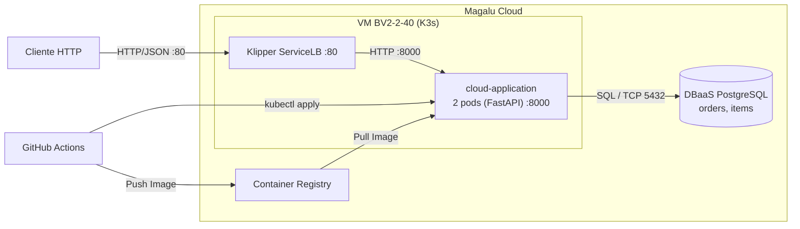

# Arquitetura da Solução

## Visão Geral
API de pedidos containerizada, desenvolvida em Python (FastAPI), rodando em um cluster K3s (nó único) em uma VM na Magalu Cloud. A solução possui banco de dados PostgreSQL gerenciado (DBaaS) externo ao cluster, imagens armazenadas no Container Registry da MGC e pipeline de deploy automatizado via GitHub Actions.

## Diagrama C2 (Container)


## Componentes

| Componente | Serviço MGC / Ferramenta | Função |
| --- | --- | --- |
| **API** | K3s (VM single node) - 2 réplicas | Processa as requisições HTTP e executa as regras de negócio. |
| **Banco de Dados** | DBaaS PostgreSQL | Persiste as tabelas `orders` e `items`. |
| **Imagens** | Container Registry | Armazena e versiona as imagens Docker da aplicação. |
| **Tráfego Externo** | Klipper ServiceLB (IP da VM, porta 80) | Distribui a carga entre os pods/réplicas e expõe a aplicação. |
| **CI/CD** | GitHub Actions | Automatiza testes, build da imagem e deploy no K3s. |

## Requisitos Não-Funcionais

| Requisito | Como Medir | Alvo |
| --- | --- | --- |
| **Disponibilidade** | Uptime dos pods via liveness/readiness probes e taxa de erro 5xx | 99,5% mensal |
| **Latência** | Histogram quantile ($P_{95}$) nas métricas da API | $P_{95} < 500$ ms |
| **Escalabilidade** | Testes de carga (k6) medindo requisições simultâneas sem degradação | 300 req/s |
| **Custo** | Recursos provisionados (VM + DBaaS + IP) na calculadora MGC | Teto definido no orçamento do projeto |

## Estilo Arquitetural

A solução adota o estilo de **monolito em camadas** (apresentação, serviços e dados), implantada como um container único escalado horizontalmente em duas réplicas.

## Trade-offs das Decisões

| Aspecto | Decisão Tomada | Alternativa Não Escolhida | Motivo da Escolha |
| --- | --- | --- | --- |
| **Orquestrador** | K3s em VM | MKS (Kubernetes Gerenciado) | Menor custo e rápida inicialização, mantendo os mesmos manifestos Kubernetes. |
| **Banco de Dados** | DBaaS Gerenciado | PostgreSQL em pod (com PVC) | Garantia de backup automático, facilidade de operação e persistência isolada do cluster. |
| **CI/CD** | GitHub Actions | Deploy Manual | Maior rastreabilidade, padronização e automação a cada atualização do código. |
| **Réplicas** | 2 Pods | 1 Pod | Garantia de disponibilidade mínima sem custo excessivo de infraestrutura. |
| **Linguagem/Framework** | FastAPI (Python) | Node.js / Go / Java | Alta produtividade, sintaxe limpa, suporte nativo a operações assíncronas e documentação automática. |

## Pontos de Melhoria e Próximos Passos


* **Versionamento da API:** Adicionar prefixos de versão na URL (ex: `/v1/orders`) para evoluir a API com retrocompatibilidade.
* **Rate Limiting:** Proteger os endpoints contra excesso de requisições e ataques de negação de serviço (DoS).


```


